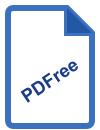

# PDFree

A free, open-source PDF toolbox desktop application built with Python and PySide6.



## Features

### View & Annotate
- **View PDF** — Full-featured viewer with zoom, rotation, two-up page mode, text selection, full-text search (Ctrl+F) with regex and match count, thumbnails, TOC sidebar, clickable links, reading position memory, split view, and multi-document tabs
- **Annotate** — Highlight, underline, strikethrough, freehand draw, shapes, arrows, sticky notes, stamps, signatures, eraser, measurement tool, and text boxes with inline editing
- **Fill Forms** — Fill AcroForm fields (text, checkbox, combobox, radio button, list box); undo/redo per document

### Organize
- **Excerpt Tool** — Load multiple PDFs, drag to select rectangular regions from any page, and collect them into a new PDF
- **Split** — Split a PDF by page ranges, every N pages, or bookmarks
- **Merge** — Combine multiple PDFs into one, reorder pages
- **Crop** — Crop pages to a selected region
- **Rotate** — Rotate individual pages or all pages
- **Watermark** — Stamp text or image watermarks
- **Compress** — Reduce file size (lossless and lossy modes)
- **Bookmarks** — Add, remove, rename, reorder, and re-level TOC entries
- **Page Labels** — Custom page numbering ranges (Roman, Arabic, prefix)

### Convert
- **PDF to CSV** — Extract tables from PDFs into CSV files
- **SVG to PDF** — Convert SVG files to PDF

### Sign & Security
- **Sign** — Cryptographic PDF signing with PKCS#12 certificates via pyhanko; optional RFC 3161 timestamping
- **Validate Signature** — Validate all embedded digital signatures; reports trust, integrity, signer DN, signing time
- **Redact** — Manual bounding-box redaction and text/regex find-and-redact; permanent removal via `apply_redactions()`
- **Add Password** — AES-256/128/RC4 encryption with 8 permission flags; edit permissions on already-encrypted PDFs
- **Form Export** — Export all AcroForm field names, types, and values to JSON, CSV, or XLSX
- **Form Unlock** — Clear ReadOnly bit on all AcroForm fields

### Other
- **PDF/A** — Convert to PDF/A-1b, -2b, or -3b; optional VeraPDF validation
- **Font Info** — List every font per page (name, type, encoding, embedded, subset); export to JSON/CSV
- **File Library** — Persistent library of your PDFs with folders, favorites, recent files, and last-read position
- **Dark / Light theme** — Toggle at runtime; preference persisted across sessions

## Installation

### Option 1 — Pre-built app (no Python required)

**Windows**
1. Go to the [Releases page](https://github.com/ArthurWie/PDFree/releases)
2. Download `PDFree_Setup.exe` from the latest release
3. Run the installer

> **Windows SmartScreen warning** — Because PDFree is not code-signed, Windows may show a blue "Windows protected your PC" dialog.
> 1. Click **More info**
> 2. Click **Run anyway**
>
> This is expected for open-source apps without a paid code-signing certificate. The source code is fully available for review.

**macOS**
1. Go to the [Releases page](https://github.com/ArthurWie/PDFree/releases)
2. Download `PDFree.dmg` from the latest release
3. Open the `.dmg` and drag **PDFree.app** to your Applications folder
4. On first launch, macOS Gatekeeper will block the app with *"PDFree cannot be opened because it is from an unidentified developer"*

> **macOS Gatekeeper warning** — PDFree is not notarized (Apple charges $99/year for this). To open it:
>
> **Option A — Right-click method (easiest)**
> 1. In Finder, right-click (or Control-click) **PDFree.app**
> 2. Select **Open** from the context menu
> 3. Click **Open** in the dialog that appears
> — You only need to do this once; future launches work normally.
>
> **Option B — System Settings**
> 1. Try to open PDFree normally (it will be blocked)
> 2. Open **System Settings → Privacy & Security**
> 3. Scroll down to the Security section — you'll see *"PDFree was blocked"*
> 4. Click **Open Anyway**
>
> **Option C — Terminal (one command)**
> ```bash
> xattr -dr com.apple.quarantine /Applications/PDFree.app
> ```
> Then open PDFree normally.

---

### Option 2 — Run from source (Windows, macOS, Linux)

**Requirements:** Python 3.11 or newer

```bash
# 1. Clone the repository
git clone https://github.com/ArthurWie/PDFree.git
cd PDFree
```

**Windows**
```bash
# 2. Create and activate a virtual environment
python -m venv .venv
.venv\Scripts\activate

# 3. Install dependencies
pip install -r requirements.txt
```

**macOS / Linux**
```bash
# 2. Create and activate a virtual environment
python3.11 -m venv .venv
source .venv/bin/activate

# 3. Install dependencies
pip install -r requirements.txt
```

## Running

```bash
python main.py
```

## Development

Install dev dependencies (includes pytest, ruff, bandit):

```bash
pip install -r requirements-dev.txt
```

Run tests:

```bash
pytest tests/
```

Lint and format:

```bash
ruff check .
ruff format .
```

## Project structure

```
main.py                  # Entry point, home screen, tool router
view_tool.py             # PDF viewer, annotations, forms
excerpt_tool.py          # Region-capture tool
split_tool.py            # Split tool
pdf_to_csv_tool.py       # Table extraction to CSV
library_page.py          # File library
sign_tool.py             # Cryptographic signing
validate_signature_tool.py  # Signature validation
redact_tool.py           # Redaction
add_password_tool.py     # Encryption and permissions
form_export_tool.py      # AcroForm export
form_unlock_tool.py      # AcroForm unlock
bookmarks_tool.py        # TOC / bookmark editor
page_labels_tool.py      # Custom page numbering
pdfa_tool.py             # PDF/A conversion
font_info_tool.py        # Font inspector
svg_to_pdf_tool.py       # SVG to PDF conversion
updater.py               # Background update checker
theme.py                 # Dark/light theme
i18n.py                  # Internationalisation
icons.py                 # Bundled Lucide SVG icon set
colors.py                # Shared design-system colour palette
utils.py                 # Shared Qt utilities
version.py               # App version and GitHub repo constants
```

## License

[MIT](LICENSE)

> **Note on PyMuPDF:** PDFree uses PyMuPDF (fitz), which is licensed under the GNU AGPL v3. Commercial distribution of software that links PyMuPDF requires an [Artifex commercial license](https://mupdf.com/licensing/). See [NOTICE](NOTICE) for full third-party license details.
